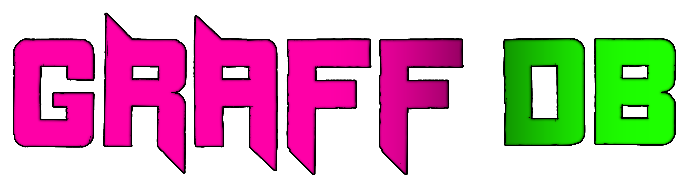

# *Anonymous Graffiti & Street Art Database*

## A graffiti and street art database focused on anonymity.

.png)

### I've always had a keen interest in both graffiti and computers.   When I was first getting into designing graffiti pieces and making street art, I found it difficult to find a centralized database for inspiration or to quickly check if certain names or styles were overused.   This personal challenge was the driving force behind creating this platform.   Contribute anonymously to a worldwide street art database – Discover art from across the globe, or easily find pieces nearest to your location to explore local scenes.

#### I have been actively developing this project since early January 2025. This entire endeavor has been an incredibly insightful journey, truly guiding me through learning a multitude of modern development concepts and practices. Building this application from the ground up served as a practical bootcamp, pushing me to understand how different components integrate to deliver a functional and interactive platform. Teaching me better than any tutorial.

#### Key Technologies & Learning Journey:

This project is built predominantly with **Python** and features a dynamic web-based interface crafted using **Streamlit**. Interactive elements and application structure are developed within the Streamlit framework for web application functionality.

For crucial interactive map functionality, `streamlit-folium` is utilized, seamlessly integrating **Folium** maps. Folium leverages underlying technologies like `Leaflet.js` and `OpenStreetMap` data to render engaging geographical visualizations, facilitating spatial data representation and web mapping.

On the backend, a robust data management system is implemented using **PostgreSQL**. This involves database design, persistence, and the execution of various **SQL requests**, enabling data insertions and complex queries for effective information retrieval and management.

Beyond the main components, the project incorporates **API interactions and web requests** for communication with outside services. Python's `requests` library is used to send specific **GET requests** for precise geocoding (e.g., Nominatim API integration). **Cloudflare R2** is integrated for efficient storage and serving of media assets (e.g., graffiti images), leveraging its S3-compatible API for cost-effective, global content delivery. This includes handling **HTTP headers** and managing network errors, with **JSON data** processing for application use.

Foundational web styling is achieved with **HTML** and **CSS**, directly tweaking Streamlit's user interface aesthetics using `st.markdown`.

Thanks to all the contributors behind these amazing open-source tools and libraries! &nbsp;&nbsp;❤

###

***

### Author: Roadbobek

## Requirements

#### To install all requirements at once run `pip install -r requirements.txt`   *(I recommend you do this in a new virtual environment.)*

* Python 3.13:
    * **Streamlit (Version 1.45.1):** (Python package) Install via pip: `pip install streamlit==1.45.1`
    * **Pillow:** (Python package) Install via pip: `pip install Pillow`
    * **requests:** (Python package) Install via pip: `pip install requests`
    * **folium:** (Python package) Install via pip: `pip install folium`
    * **streamlit-folium:** (Python package) Install via pip: `pip install streamlit-folium`
    * **bcrypt:** (Python package) Install via pip: `pip install bcrypt`
    * **captcha:** (Python package) Install via pip: `pip install captcha`

## License

#### Copyright (c) 2025 Roadbobek

This software is licensed under the MIT License.  
See the LICENSE.txt file for details

#### MIT License
